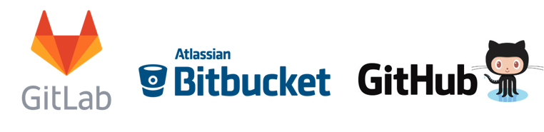
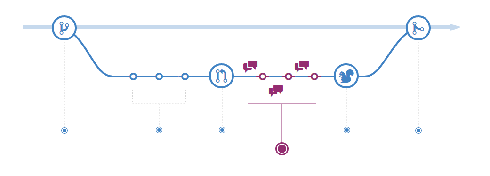

```{r setup, include=FALSE}
knitr::opts_chunk$set(echo = FALSE)
```

## ¿Qué es un sistema de control de versiones?

- Supervisa el historial de cambios realizados por integrantes de un proyecto

- Se puede contribuir, discutir cambios y regresar a versiones pasadas

- Qué, Cómo, Cúando, Por qué?



## ¿Qué es un repositorio?

- Todos los archivos y carpetas asociadas a un proyecto junto con la revisión del historial de cada paso es un repositorio
- El historial de cada archivo aparece como una fotografía que se conoce como ***commit**
- Cada fotografía está asociada y organizada mediante diferentes lineas de desarrollo llamadas **branch**
- Usar la línea de comandos permite una interfaz rápida al repositorio git para interactuar con el historial, clonar, crear *branches*, *commits*, *merges* para comparar el código a través de todas las versiones



## Comandos básicos de git

- ```git init``` Inicializa un nuevo proyecto Git.Agrega una carpeta oculta donde guarda la estructura interna requerida para el versionado

- ```git clone``` Crea una copia local en un proyecto existente de manera remota que incluye todas los archivos, carpetas y versiones

- ```git add ``` Git supervisa los cambios hechos en el código, pero es necesario 2 pasos, uno es agregar los archivos a los cuales se les va a tomar la fotografía y una parte del historial del proyecto.

- ```git commit ``` Toma una fotografía del historial del proyecto y completar el cambio y supervisión.
Todo lo que se agregue con ```git add `` debe tener su fotografía

- ```git status ``` muestra los cambios modificados o listos para su revisión

## Comandos básicos de git

- ```git branch ``` muestra las ramas que se están utilizando en el repositoro

-```git checkout mi-rama ``` cambia a otra rama para hacer cambios

- ```git pull ``` actuliza la línea local de desarrollo con los cambios realizados remotamente. Normalmente se usa por si otras personas tienen ramas que quieren integrarse a la al proyecto local

- ```git push ``` actuliza el repositorio remoto con las fotografías hechas de manera local a una rama

- [Lista del total de comandos para git](https://git-scm.com/docs)

## Flujo de github

- **Crear un branch** Diferentes ramas permiten contribuir de manera paralela a un proyecto

- **Add y commit** Toma una fotografía del desarrollo para tener puntos revertibles en la historia de un proyeceto

- **pull request** Publica los cambios realizados para tener un proceso transparente en desarrollo 

- **Discución y revisión de código** Los integrantes del equipo pueden revisar los *pull requests* de tal forma de manter un entorno de colaboración

- **Merge** Agrega los cambios revisados por todos al proyecto

## Modelos de colaboración de desarrollo

- **Shared repository** Se otorga acceso de escritura, lectura, administración y ramas protegias. Se crea una estructura jerárquica entre los colaboradores

- **Fork pull** Normalmente usado en proyectos publicos, donde cualquier pesona puede colaborar. Un *fork* es una copia de un proyecto dentro del perfil de alguien más. Los adimistradores pueden recibir sugerencias para cambiar cosas. [Forking proyects Guide](https://guides.github.com/activities/forking/)

## Referencias posteriores
- [tutoriales github](https://services.github.com/on-demand/)
- [tutorial interactivo](https://www.datacamp.com/courses/introduction-to-git-for-data-science)
- [tutorial github desktop](https://www.youtube.com/watch?v=77W2JSL7-r8)

